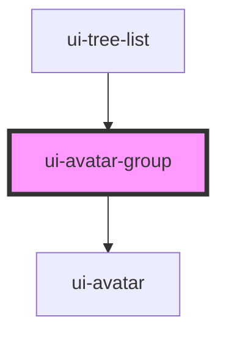

# ui-avatar-group

<!-- Auto Generated Below -->

## Properties

| Property     | Attribute     | Description                                       | Type            | Default     |
| ------------ | ------------- | ------------------------------------------------- | --------------- | ----------- |
| `avatars`    | --            | Array of avatar props                             | `AvatarProps[]` | `[]`        |
| `max`        | `max`         | Alias for maxVisible (backward compatibility)     | `number`        | `undefined` |
| `maxVisible` | `max-visible` | Maximum number of avatars to show before grouping | `number`        | `5`         |
| `size`       | `size`        | Size of avatars (used to calculate overlap)       | `string`        | `'40px'`    |

## Dependencies

### Used by

 - [ui-tree-list](../tree-list)

### Depends on

- [ui-avatar](../avatar)

### Graph

----------------------------------------------

*Built with [StencilJS](https://stenciljs.com/)*
