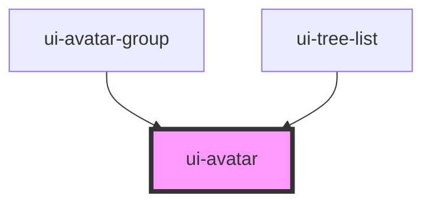

# ui-avatar

<!-- Auto Generated Below -->

## Properties

| Property     | Attribute     | Description                                                                                                                       | Type                   | Default     |
| ------------ | ------------- | --------------------------------------------------------------------------------------------------------------------------------- | ---------------------- | ----------- |
| `badge`      | `badge`       | Badge text to display on the avatar                                                                                               | `string`               | `undefined` |
| `badgeColor` | `badge-color` | Badge color (applies to both dot and text badges). Accepts any CSS color. Example: "#22c55e", "rgb(34,197,94)", "var(--success)". | `string`               | `undefined` |
| `content`    | `content`     | Content to display (letter or text)                                                                                               | `string`               | `undefined` |
| `icon`       | `icon`        | Icon to display (e.g., SVG or icon name)                                                                                          | `string`               | `undefined` |
| `shape`      | `shape`       | Shape of the avatar: 'square' or 'circle'                                                                                         | `"circle" \| "square"` | `'circle'`  |
| `size`       | `size`        | Size of the avatar (e.g., '40px', '2rem')                                                                                         | `string`               | `'40px'`    |
| `src`        | `src`         | Image source URL                                                                                                                  | `string`               | `undefined` |

## Dependencies

### Used by

 - [ui-avatar-group](../avatar-group)
 - [ui-tree-list](../tree-list)

### Graph

----------------------------------------------

*Built with [StencilJS](https://stenciljs.com/)*
