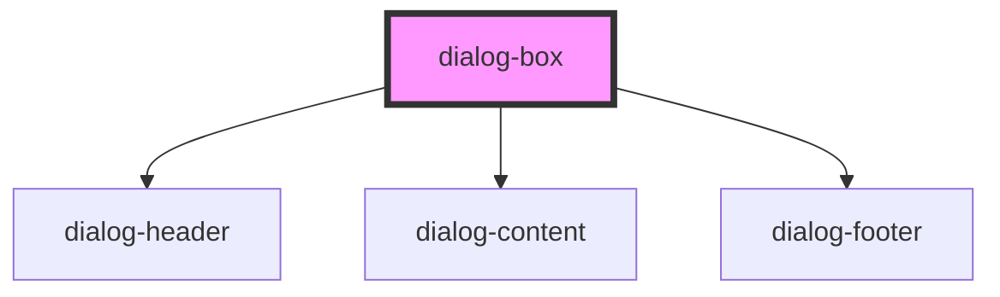

# dialog-box

<!-- Auto Generated Below -->

## Properties

| Property       | Attribute       | Description                     | Type                                                       | Default      |
| -------------- | --------------- | ------------------------------- | ---------------------------------------------------------- | ------------ |
| `dialogTitle`  | `dialog-title`  | Dialog title                    | `string`                                                   | `''`         |
| `height`       | `height`        | Dialog height                   | `string`                                                   | `'auto'`     |
| `maximized`    | `maximized`     | Whether the dialog is maximized | `boolean`                                                  | `false`      |
| `minimized`    | `minimized`     | Whether the dialog is minimized | `boolean`                                                  | `false`      |
| `open`         | `open`          | Whether the dialog is open      | `boolean`                                                  | `false`      |
| `showClose`    | `show-close`    | Whether to show close button    | `boolean`                                                  | `true`       |
| `showMaximize` | `show-maximize` | Whether to show maximize button | `boolean`                                                  | `true`       |
| `showMinimize` | `show-minimize` | Whether to show minimize button | `boolean`                                                  | `true`       |
| `status`       | `status`        | Dialog status/type              | `"default" \| "error" \| "info" \| "success" \| "warning"` | `'default'`  |
| `variant`      | `variant`       | Dialog variant style            | `"filled" \| "outlined"`                                   | `'outlined'` |
| `width`        | `width`         | Dialog width                    | `string`                                                   | `'500px'`    |

## Events

| Event             | Description                            | Type                                   |
| ----------------- | -------------------------------------- | -------------------------------------- |
| `dialogClosed`    | Event emitted when dialog is closed    | `CustomEvent<any>`                     |
| `dialogMaximized` | Event emitted when dialog is maximized | `CustomEvent<{ maximized: boolean; }>` |
| `dialogMinimized` | Event emitted when dialog is minimized | `CustomEvent<{ minimized: boolean; }>` |

## Methods

### `hide() => Promise<void>`

Close the dialog

#### Returns

Type: `Promise<void>`

### `maximize() => Promise<void>`

Maximize the dialog

#### Returns

Type: `Promise<void>`

### `minimize() => Promise<void>`

Minimize the dialog

#### Returns

Type: `Promise<void>`

### `show() => Promise<void>`

Open the dialog

#### Returns

Type: `Promise<void>`

## Dependencies

### Depends on

- [dialog-header](../dialog-header)
- [dialog-content](../dialog-content)
- [dialog-footer](../dialog-footer)

### Graph

----------------------------------------------

*Built with [StencilJS](https://stenciljs.com/)*
