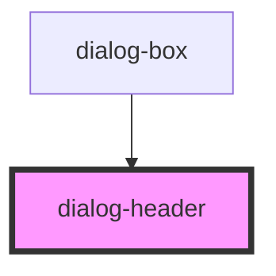

# dialog-header

<!-- Auto Generated Below -->

## Properties

| Property       | Attribute       | Description                     | Type                                                       | Default      |
| -------------- | --------------- | ------------------------------- | ---------------------------------------------------------- | ------------ |
| `dialogTitle`  | `dialog-title`  | Dialog title                    | `string`                                                   | `''`         |
| `showClose`    | `show-close`    | Whether to show close button    | `boolean`                                                  | `true`       |
| `showMaximize` | `show-maximize` | Whether to show maximize button | `boolean`                                                  | `true`       |
| `showMinimize` | `show-minimize` | Whether to show minimize button | `boolean`                                                  | `true`       |
| `status`       | `status`        | Dialog status/type              | `"default" \| "error" \| "info" \| "success" \| "warning"` | `'default'`  |
| `variant`      | `variant`       | Dialog variant style            | `"filled" \| "outlined"`                                   | `'outlined'` |

## Events

| Event      | Description                                   | Type               |
| ---------- | --------------------------------------------- | ------------------ |
| `close`    | Event emitted when close button is clicked    | `CustomEvent<any>` |
| `maximize` | Event emitted when maximize button is clicked | `CustomEvent<any>` |
| `minimize` | Event emitted when minimize button is clicked | `CustomEvent<any>` |

## Dependencies

### Used by

 - [dialog-box](../dialog-box)

### Graph

----------------------------------------------

*Built with [StencilJS](https://stenciljs.com/)*
