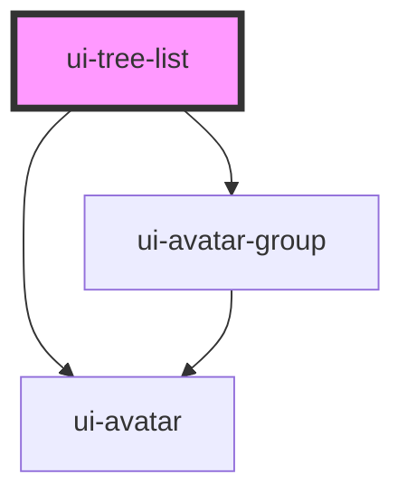

# ui-tree-list

A hierarchical tree component with support for expansion, selection, checkboxes, avatars, avatar groups, and lock icons.

## Features

- 🌳 Hierarchical tree structure
- ✅ Checkboxes for multi-selection
- 🔒 Lock icons for read-only items
- 👤 Single avatar support
- 👥 Avatar group support for multiple collaborators
- 🎨 Three size variants (sm, md, lg)
- 🎯 Action menu for each node
- 📱 Responsive design

## Basic Usage

```html
<ui-tree-list data='[...]'></ui-tree-list>
```

## TreeNode Interface

```typescript
interface TreeNode {
  key: string | number;
  label: string;
  icon?: string;
  avatar?: string;                    // Single avatar (URL or component)
  avatars?: Array<{                   // Avatar group
    src?: string;
    label?: string;
    initials?: string;
    color?: string;
  }>;
  locked?: boolean;                   // Shows lock icon
  lockTooltip?: string;              // Custom tooltip for lock icon
  disabled?: boolean;
  checked?: boolean;
  children?: TreeNode[];
  expanded?: boolean;
  selected?: boolean;
  metadata?: any;
}
```

## Examples

### Tree with Lock Icons

```javascript
const data = [
  {
    key: 'file1',
    label: 'Protected File',
    icon: '📄',
    locked: true,
    lockTooltip: 'This file is read-only',
    avatar: 'https://i.pravatar.cc/150?img=1'
  }
];
```

### Tree with Avatar Groups

```javascript
const data = [
  {
    key: 'doc1',
    label: 'Collaborative Document',
    icon: '📋',
    avatars: [
      { src: 'https://i.pravatar.cc/150?img=1', label: 'John' },
      { src: 'https://i.pravatar.cc/150?img=2', label: 'Jane' },
      { initials: 'AB', color: 'blue', label: 'Alex' }
    ]
  }
];
```

### Mixed Usage

```javascript
const data = [
  {
    key: 'folder',
    label: 'Project Folder',
    icon: '📁',
    children: [
      {
        key: 'locked-file',
        label: 'Config File',
        icon: '⚙️',
        locked: true,
        lockTooltip: 'System configuration - requires admin',
        avatar: 'https://i.pravatar.cc/150?img=5'
      },
      {
        key: 'team-doc',
        label: 'Team Document',
        icon: '📝',
        avatars: [
          { src: 'https://i.pravatar.cc/150?img=10' },
          { src: 'https://i.pravatar.cc/150?img=11' },
          { initials: '+3', color: 'gray' }
        ]
      }
    ]
  }
];
```


<!-- Auto Generated Below -->


## Properties

| Property           | Attribute            | Description                 | Type                   | Default |
| ------------------ | -------------------- | --------------------------- | ---------------------- | ------- |
| `data`             | `data`               | Tree data                   | `TreeNode[] \| string` | `[]`    |
| `defaultExpandAll` | `default-expand-all` | Expand all nodes by default | `boolean`              | `false` |
| `disabled`         | `disabled`           | Disabled state              | `boolean`              | `false` |
| `multiSelect`      | `multi-select`       | Allow multiple selection    | `boolean`              | `false` |
| `selectable`       | `selectable`         | Enable selection            | `boolean`              | `true`  |
| `showCheckbox`     | `show-checkbox`      | Show checkboxes             | `boolean`              | `false` |
| `showExpandIcon`   | `show-expand-icon`   | Show expand/collapse icons  | `boolean`              | `true`  |
| `showLines`        | `show-lines`         | Show connecting lines       | `boolean`              | `true`  |
| `size`             | `size`               | Size variant                | `"lg" \| "md" \| "sm"` | `'md'`  |


## Events

| Event        | Description                                   | Type                                                                                    |
| ------------ | --------------------------------------------- | --------------------------------------------------------------------------------------- |
| `treeAction` | Event emitted when action menu is clicked     | `CustomEvent<{ node: TreeNode; action: string; }>`                                      |
| `treeCheck`  | Event emitted when checkbox is toggled        | `CustomEvent<{ node: TreeNode; checked: boolean; checkedKeys: (string \| number)[]; }>` |
| `treeExpand` | Event emitted when node is expanded/collapsed | `CustomEvent<{ node: TreeNode; expanded: boolean; }>`                                   |
| `treeSelect` | Event emitted when node is selected           | `CustomEvent<{ node: TreeNode; selected: boolean; }>`                                   |


## Dependencies

### Depends on

- [ui-avatar-group](../avatar-group)
- [ui-avatar](../avatar)

### Graph


----------------------------------------------

*Built with [StencilJS](https://stenciljs.com/)*
