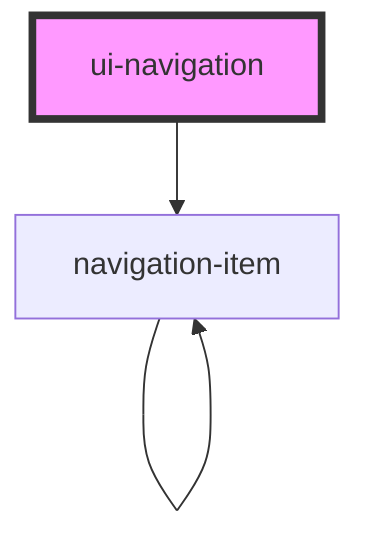

# ui-navigation

<!-- Auto Generated Below -->

## Properties

| Property            | Attribute            | Description | Type                                         | Default                                        |
| ------------------- | -------------------- | ----------- | -------------------------------------------- | ---------------------------------------------- |
| `animationDuration` | `animation-duration` |             | `number`                                     | `350`                                          |
| `blocks`            | --                   |             | `NavigationBlock[]`                          | `['header', 'primary', 'secondary', 'footer']` |
| `collapsed`         | `collapsed`          |             | `boolean`                                    | `false`                                        |
| `collapsedHeight`   | `collapsed-height`   |             | `string`                                     | `'64px'`                                       |
| `collapsedWidth`    | `collapsed-width`    |             | `string`                                     | `'64px'`                                       |
| `easing`            | `easing`             |             | `string`                                     | `'cubic-bezier(0.4,0,0.2,1)'`                  |
| `floating`          | `floating`           |             | `boolean`                                    | `false`                                        |
| `height`            | `height`             |             | `string`                                     | `'100vh'`                                      |
| `items`             | --                   |             | `NavigationItem[]`                           | `[]`                                           |
| `orientation`       | `orientation`        |             | `"horizontal" \| "vertical"`                 | `'vertical'`                                   |
| `shadowDom`         | `shadow-dom`         |             | `boolean`                                    | `true`                                         |
| `theme`             | `theme`              |             | `"custom" \| "dark" \| "default" \| "glass"` | `'default'`                                    |
| `width`             | `width`              |             | `string`                                     | `'240px'`                                      |

## Events

| Event               | Description | Type                                          |
| ------------------- | ----------- | --------------------------------------------- |
| `navItemClick`      |             | `CustomEvent<NavigationItem>`                 |
| `navToggle`         |             | `CustomEvent<boolean>`                        |
| `submenuOpenChange` |             | `CustomEvent<{ id: string; open: boolean; }>` |

## Dependencies

### Depends on

- [navigation-item](.)

### Graph

----------------------------------------------

*Built with [StencilJS](https://stenciljs.com/)*
